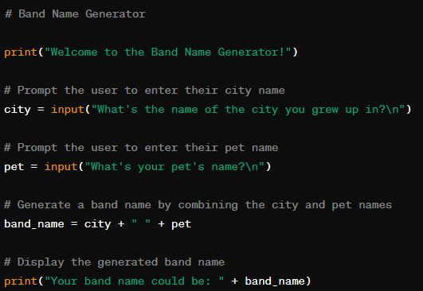
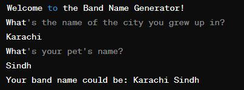

# Day 1 of #100DaysOfCode: Launching into Python Mastery!

Today marks the commencement of my exhilarating #100DaysOfCode journey, as I dive headlong into the vibrant world of Python.

## Day 1:
Establishing a robust foundation is paramount. I delved into the bedrock of Python, revisiting the essentials such as variables, data types, operators, and the enchantment of `print()` statements. ✨ It's truly remarkable how these elemental concepts lay the groundwork for intricate coding marvels!

### First Endeavor:
What better way to inaugurate this journey than with a captivating project? I crafted a band name generator, infusing creativity into code. This pet project provided a canvas to apply newfound knowledge, employing `input()` to capture user input and string manipulation to craft catchy band monikers from city and pet names.

### Sentiments:
Bursting with enthusiasm, motivation, and a hunger for knowledge, I'm primed to tackle the forthcoming 99 days with gusto! This is merely the inception, and I eagerly anticipate the discoveries and creations that lie ahead.

---

## Code Snippet:

## Output:

---

What about you? What coding pursuits are fueling your passions? Share your odyssey in the comments below! Let's foster a community of mutual support and inspiration as we navigate this coding adventure together.
