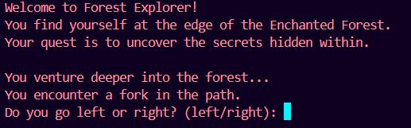
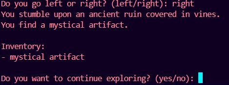
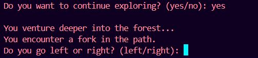
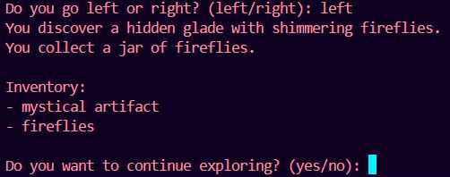
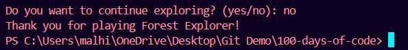

# Day 3 of #100DaysOfCode: Embark on a Thrilling Journey with Forest Explorer! 🌳

🚀 **Day 3:** Venture into the mystical Enchanted Forest with Forest Explorer! Craft a captivating narrative and dynamic decision-making using Python's conditional statements.

## Overview:
Forest Explorer is a text-based adventure game built with Python that takes players on an epic journey through the Enchanted Forest. With dynamic decision-making and immersive storytelling, players uncover hidden groves, encounter mythical creatures, and explore ancient ruins as they shape their destiny.

### Features:
- **Introduction:** Welcome players to Forest Explorer and set the scene for their adventure.
- **Exploration:** Journey deeper into the forest, encountering forks in the path and making decisions that impact the outcome.
- **Inventory:** Collect mystical artifacts and treasures to enrich your adventure.
- **Game Loop:** Engage players in an immersive gaming experience with a continuous loop of exploration and decision-making.

### How to Play:
1. Ensure you have Python installed on your system.
2. Download the `forest_explorer.py` script from this repository.
3. Open your terminal or Python environment.
4. Navigate to the directory containing `forest_explorer.py`.
5. Run the command `python forest_explorer.py` to start the game.
6. Follow the on-screen prompts to explore the Enchanted Forest and make decisions that shape your journey.

### Output:
Welcome to Forest Explorer! Embark on an adventure through the Enchanted Forest and uncover its secrets.

You find yourself at the edge of the Enchanted Forest. Your quest is to uncover the secrets hidden within.

You venture deeper into the forest and encounter a fork in the path. Do you go left or right?

You stumble upon an ancient ruin covered in vines. You find a mystical artifact.

You discover a hidden glade with shimmering fireflies. You collect a jar of fireflies.

### Future Improvements:
- Add more diverse environments and encounters within the Enchanted Forest.
- Implement a scoring system or leaderboard to track players' progress.
- Introduce more complex decision-making scenarios and branching storylines.

Feeling the thrill of adventure with Forest Explorer! ✨ Onwards to Day 4!

---

What about you? Have you ventured into any coding adventures recently? Share your experiences in the comments below! Let's inspire and motivate each other on this coding journey.
