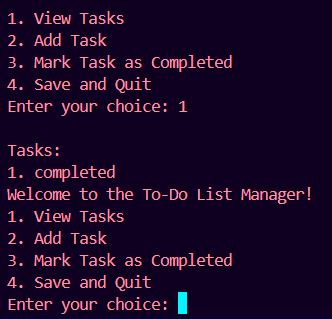

# 🎉 Day 4 of 100 Days of Code: Mastering University Assignments with Python! 🎉

Today's triumph is extra special as I tackle a task assigned by my university: **building a To-Do List Manager with Python!** 💼💻

## Why It Matters:
- **Academic Integration:** Aligning my coding journey with academic challenges enhances my learning experience and fosters real-world application of concepts.
- **Empowering Productivity:** Crafting a To-Do List Manager equips me with a valuable tool to enhance my personal productivity and organization skills.
- **Continuous Growth:** Incorporating university tasks into my #100DaysOfCode challenge ensures consistent progress, reinforcing the commitment to lifelong learning and skill development.

Every line of code brings me closer to academic excellence and coding proficiency. 💪✨ How do you integrate your academic pursuits with your coding journey? Let's share insights and inspire each other! 🌟💬

---

**🚀 Project Overview:**

- **Objective:** Build a To-Do List Manager with Python.
- **Features:** Implement features for adding tasks, marking tasks as completed, and managing task lists.
- **Technology:** Python programming language.
- **Motivation:** Enhance personal productivity and organization skills while meeting academic requirements.

---

**📝 How to Use:**

1. **Install Python:** If you haven't already, [download and install Python](https://www.python.org/downloads/) on your computer.
2. **Run the Script:** Open your terminal or command prompt, navigate to the project directory, and run the script using the command `python todo_manager.py`.
3. **Interact with the To-Do List Manager:** Follow the on-screen prompts to add, manage, and complete tasks.

---
### Output:
Write in that and create a programs by file handling method

**🌟 Let's Connect:**

- Connect on LinkedIn: [Your LinkedIn Profile](https://www.linkedin.com/in/santoshkumarsk/)
- Explore more projects: [GitHub Profile](https://github.com/your-username)

---

**What about you? How do you integrate your academic pursuits with your coding journey? Share your experiences in the comments below! Let's learn from each other and keep pushing towards our goals!**
