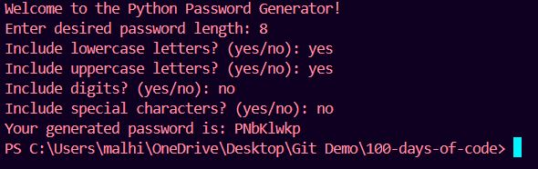

# 🚀 Day 5 of 100 Days of Code: Fortifying Security with Python Passwords! 🚀

Today marks another exhilarating milestone in my #100DaysOfCode journey! 🎉 I'm thrilled to unveil my latest creation: a Python app that generates ultra-secure passwords. 💻🔒

## Unlocking the Power of Python:
- **User Input Mastery:** Crafting a seamless experience by capturing user preferences for password length and character types.
- **Randomization Expertise:** Harnessing the magic of randomness to assemble characters from various categories, ensuring bulletproof security.
- **String Manipulation Savvy:** Skillfully weaving together characters to craft robust and resilient passwords.
- **Data Type Dexterity:** Navigating effortlessly between numbers, strings, and lists to execute sophisticated password generation algorithms.

This project has been an exhilarating journey of growth and discovery, empowering me to make a tangible impact in the realm of digital security. 💪💡 What coding challenges are you conquering on your #100DaysOfCode odyssey? Let's ignite inspiration and foster innovation together! 🌟🚀

---

**🔐 Project Overview:**

- **Objective:** Develop a Python Password Generator app to create ultra-secure passwords.
- **Features:** Allow user input for password length and character types, utilize randomness for password generation, and ensure robustness and resilience in password creation.
- **Technology:** Python programming language.
- **Impact:** Enhance digital security and empower users with strong and reliable passwords.

---

**📝 How to Use:**

1. **Install Python:** If you haven't already, [download and install Python](https://www.python.org/downloads/) on your computer.
2. **Install Required Libraries:** Open your terminal or command prompt and install the required libraries using the following commands: 
    pip install random  
    pip install string
3. **Run the Script:** Navigate to the project directory in your terminal or command prompt, and run the script using the command `python password_generator.py`.
4. **Generate Passwords:** Follow the on-screen prompts to specify password length and character types, and generate ultra-secure passwords.

---

### Output:
Write in that and create a programs by file handling method

**🌟 Let's Connect:**

- Connect on LinkedIn: [Your LinkedIn Profile](https://www.linkedin.com/in/santoshkumarsk/)
- Explore more projects: [GitHub Profile](https://github.com/SantoshMalhi)

---

**What coding challenges are you conquering on your #100DaysOfCode odyssey? Share your experiences in the comments below! Let's ignite inspiration and foster innovation together!**
