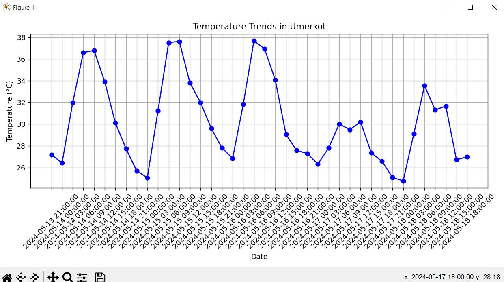

# 🚀 Day 6 of 100 Days of Code: Exploring Weather Data with Python! 🌦️📊

Today, I embarked on a journey into the fascinating realm of data exploration using Python. With a focus on weather data, I've created a simple yet powerful program that visualizes temperature trends over the past month in my local area.

## Highlights of Today's Adventure:
- **Data Collection:** Utilizing Python libraries to fetch weather data from an API, making it accessible for analysis.
- **Basic Visualization:** Employing Matplotlib, a beginner-friendly plotting library, to create clear and easy-to-understand line graphs showcasing temperature fluctuations.
- **Interpretation:** Gaining insights into weather patterns by observing trends and variations in temperature data.

Through this project, I'm not only honing my Python skills but also gaining a deeper understanding of weather patterns in my region.

What coding challenges are you tackling in your #100DaysOfCode journey? Share your experiences and let's inspire each other to keep pushing forward! 💻🌟

---

**📈 Project Overview:**

- **Objective:** Explore weather data using Python and visualize temperature trends over time.
- **Features:** Fetch weather data from an API, create line graphs using Matplotlib, and gain insights into temperature patterns.
- **Technology:** Python programming language, Matplotlib library.
- **Learning:** Enhance data exploration skills and gain insights into weather patterns.

---

**📝 How to Use:**

1. **Install Python:** If you haven't already, [download and install Python](https://www.python.org/downloads/) on your computer.
2. **Install Dependencies:** Run `pip install requests matplotlib` to install the required Python libraries.
3. **Get API Key:** Sign up on [OpenWeatherMap](https://openweathermap.org/) to get your API key.
4. **Update Code:** Replace `'your_api_key'` with your actual API key and `'your_city'` with your city name in the `fetch_weather_data` function.
5. **Run the Script:** Open your terminal or command prompt, navigate to the project directory, and run the script using the command `python weather_explorer.py`.
6. **Explore Weather Data:** Follow the on-screen prompts to fetch weather data, visualize temperature trends, and gain insights.

---

### Output:
According to API used in this code the output will be show as 

**🌟 Let's Connect:**

- Connect on LinkedIn: [Your LinkedIn Profile](https://www.linkedin.com/in/santoshkumarsk/)
- Explore more projects: [GitHub Profile](https://github.com/SantoshMalhi)

---

**What coding challenges are you tackling in your #100DaysOfCode journey? Share your experiences and let's inspire each other to keep pushing forward!**
