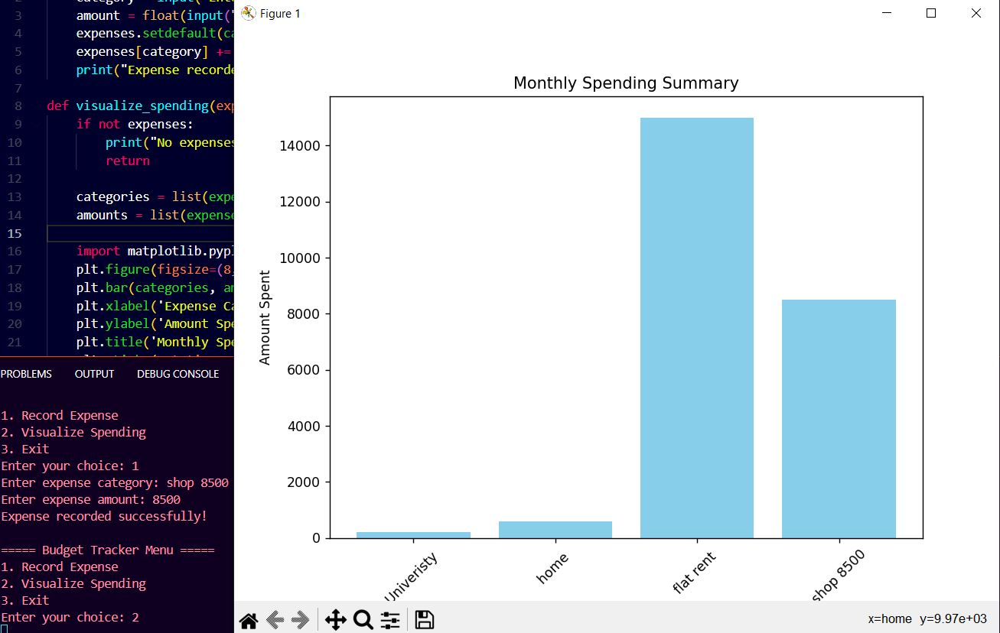

# 🌟 Day 7 of 100 Days of Code: Jumpstarting Personal Finance Mastery with Python! 💻

Despite a delayed start due to intense university exams, today marks the beginning of my journey into personal finance management with Python. Armed with a Budget Tracker, I'm ready to take charge of my spending habits and visualize financial insights like never before.

## Key Highlights:
- **Expense Recording:** Seamlessly inputting and categorizing expenses for a comprehensive financial overview.
- **Data Visualization:** Leveraging Matplotlib for dynamic bar charts that illuminate monthly spending patterns.
- **Empowerment Through Coding:** Transforming raw data into actionable insights for smarter financial decisions.

Late start, but unstoppable momentum. Let's code our way to financial freedom!

---

**🚀 Project Overview:**

- **Objective:** Develop a Budget Tracker using Python to manage personal finances.
- **Features:** Input and categorize expenses, visualize spending patterns using Matplotlib, and gain insights into financial habits.
- **Technology:** Python programming language, Matplotlib library.
- **Impact:** Empower users with tools for better financial management and decision-making.

---

**📝 How to Use:**

1. **Install Python:** If you haven't already, [download and install Python](https://www.python.org/downloads/) on your computer.
2. **Install Dependencies:** No additional dependencies required.
3. **Run the Script:** Open your terminal or command prompt, navigate to the project directory, and run the script using the command `python budget_tracker.py`.
4. **Record Expenses:** Follow the on-screen prompts to input and categorize expenses.
5. **Visualize Financial Insights:** View dynamic bar charts generated by the Budget Tracker to understand monthly spending patterns.

---

**📊 Output:**
According to my Data putting

- **Visualize Spending:** 

---

**🌟 Let's Connect:**

- Connect on LinkedIn: [Your LinkedIn Profile](https://www.linkedin.com/in/santoshkumarsk/)
- Explore more projects: [GitHub Profile](https://github.com/SantoshMalhi)

---

**Ready to take control of your finances? Join me on this coding journey to financial empowerment!**
