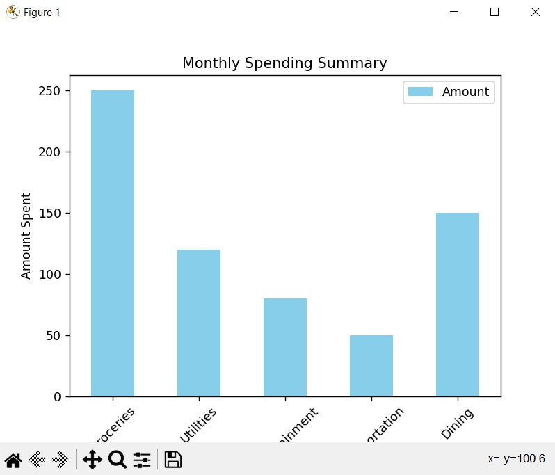

# 🚀 Day 8 of 100 Days of Code: Supercharging Personal Finance Skills with Python! 💼💡

Today's progress in personal finance management is powered by Python prowess! Despite a brief hiatus during university exams, I'm back in the coding saddle, ready to revolutionize my Budget Tracker project.

## Key Highlights:
- **Feature Frenzy:** Introducing a wave of enhancements to my Budget Tracker, from streamlined expense categorization to dynamic data visualization. It's all about making financial management effortless and insightful.
- **Data Dive:** Diving deep into data analysis with Python's formidable toolkit. Uncovering hidden spending trends and unlocking actionable insights to fuel informed financial decisions.
- **Coding Confidence:** With each line of code, my coding confidence soars higher. Embracing challenges as stepping stones to mastery, I'm committed to pushing boundaries and expanding my skill set.

Similar to the previous challenge, but now with an advanced twist! This time, the code is turbocharged with new features and refinements. Late to the challenge, but not lacking in determination! Let's code our way to financial freedom and coding excellence!

---

**🚀 Project Overview:**

- **Objective:** Enhance the Budget Tracker project with advanced features and refinements for comprehensive financial management.
- **Features:** Streamlined expense categorization, dynamic data visualization, and deep data analysis capabilities.
- **Technology:** Python programming language, Matplotlib library, advanced data analysis techniques.
- **Impact:** Empower users with advanced tools for effortless financial management and data-driven decision-making.

---

**📝 Requirements:**

1. **Python:** Ensure you have Python installed on your computer. If not, download and install Python from [python.org](https://www.python.org/downloads/).
2. **Dependencies:** Install the required libraries by running `pip install matplotlib pandas` in your terminal or command prompt.

---

**📊 Output:**

- **Visualize Spending:** 

---

**🌟 Let's Connect:**

- Connect on LinkedIn: [Your LinkedIn Profile](https://www.linkedin.com/in/santoshkumarsk/)
- Explore more projects: [GitHub Profile](https://github.com/SantoshMalhi)

---

**Ready to supercharge your personal finance skills? Dive into the advanced features of the Budget Tracker project and unlock a world of financial insights!**
