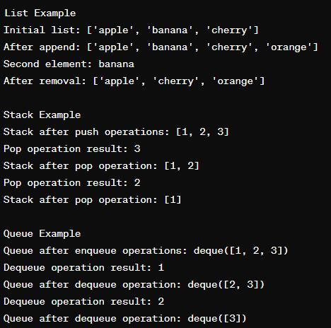

# Data Structures in Python

## Overview
This repository contains examples of fundamental data structures implemented in Python. The project includes demonstrations of lists, stacks, and queues, showcasing basic operations like insertion, deletion, and traversal.

## Project Structure
- `data_structures.py`: The main script containing the implementations of the data structures.

## Features
- **Lists:** Dynamic arrays with support for various operations such as appending, accessing, and removing elements.
- **Stacks:** LIFO (Last In First Out) structure implemented using Python lists with push and pop operations.
- **Queues:** FIFO (First In First Out) structure implemented using Python's `collections.deque` with enqueue and dequeue operations.

## Usage
To run the script, execute the following command in your terminal:
```sh
# python data_structures.py


**📊 Output:**

- **Output** 

---

**🌟 Let's Connect:**

- Connect on LinkedIn: [Your LinkedIn Profile](https://www.linkedin.com/in/santoshkumarsk/)
- Explore more projects: [GitHub Profile](https://github.com/SantoshMalhi)

---

**Ready to supercharge your personal finance skills? Dive into the advanced features of the Budget Tracker project and unlock a world of financial insights!**
