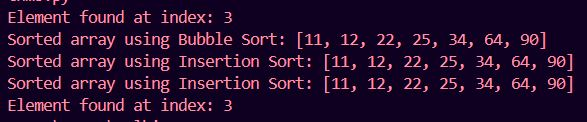

# Basic Algorithm Problems with Python

## Overview
This repository contains solutions to basic algorithmic problems implemented in Python. The project includes examples of sorting and searching algorithms, showcasing fundamental problem-solving techniques.

## Project Structure
- `basic_algorithms.py`: The main script containing implementations of sorting and searching algorithms.

## Features
- **Sorting Algorithms:** Includes Bubble Sort and Insertion Sort for arranging data efficiently.
- **Searching Algorithms:** Implements Linear Search and Binary Search for quickly locating elements within datasets.

## Usage
<!-- To run the script, execute the following command in your terminal: -->
<!-- ```sh -->
python basic_algorithms.py

**📊 Output:**

- **Output** 

---

**🌟 Let's Connect:**

- Connect on LinkedIn: [LinkedIn Profile](https://www.linkedin.com/in/santoshkumarsk/)
- Explore more projects: [GitHub Profile](https://github.com/SantoshMalhi)

---

**Ready to supercharge your coding skills? Dive into the world of algorithms and unlock a new realm of problem-solving proficiency!**
